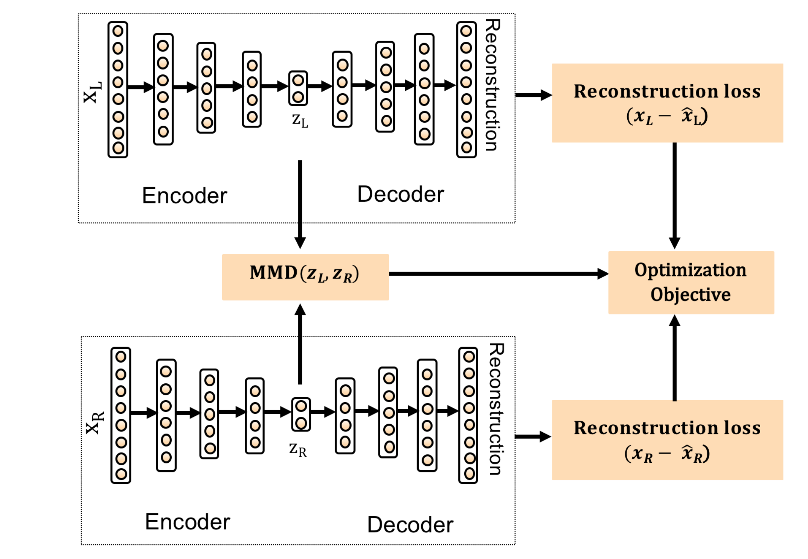

# Cadence: A Practical Time-series Partitioning Algorithm for Unlabeled IoT Sensor Streams

Source: Chowdhury, T., Aldeer, M., Laghate, S., et al. (2021). Time Series Segmentation Using Autoencoders. arXiv preprint arXiv:2112.03360. [DOI: 10.48550/arXiv.2112.03360](https://doi.org/10.48550/arXiv.2112.03360).

Change Point Detection (CPD) algorithms aim to identify when the probability distribution of a stochastic process changes. This paper introduces 'Cadence', a sample-efficient and robust algorithm for time-series segmentation, specifically for IoT sensor streams.

Although the paper mentions release of an open-source library to be built, no code samples were found online at the time of writing this code sample. This repo serves as a practice material to convert a paper to code and may contain implementation errors.

The algorithm operates by partitioning the dataset into pairs of non-overlapping, consecutive segments demarcated by a specified window size. Each pair of segments is then fed into a single auto-encoder neural network, which serves two primary functions: reducing the dimensionality of the data and extracting latent feature representations. The auto-encoder is trained to minimize the reconstruction loss for both segments while simultaneously incorporating a Maximum Mean Discrepancy (MMD) loss.

The MMD loss is a statistical measure that quantifies the disparity between two probability distributions. It serves as a probabilistic indicator of whether the samples from the two segments originate from the same distribution. Consequently, this measure also acts as a gauge for change points within the data. Through this dual-objective learning process, the model not only acquires a compressed representation of the data's latent features but also hones its ability to discern samples from distinct distributions. This sophisticated learning mechanism enables the model to identify change points with a high degree of accuracy, facilitating a more nuanced understanding of the underlying time-series data.

## 1) Create non-overlapping consecutive segments of this data as:

Let $ Y = \{y_1, y_2, y_3, \ldots, y_t\} $ be a time series dataset, where $ y_t \in \mathbb{R}^d $ and $ Y \in \mathbb{R}^{t \times d} $. Where $ Y $ is a time-series matrix of $ d $ features and $ t $ samples.

$ x_L = \{y_{t-w}, \ldots, y_{t-1}\} $: Past segment

$ x_R = \{y_t, \ldots, y_{t+w-1}\} $: Current segment

$ w $: Sliding window size, 25 in the paper.

*Figure: Representation of non-overlapping consecutive segment tensors $ X_L $ and $ X_R $ as used in the model. Adapted from Chowdhury, T., Aldeer, M., Laghate, S., et al. (2021). Time Series Segmentation Using Autoencoders. arXiv preprint arXiv:2112.03360. [DOI: 10.48550/arXiv.2112.03360](https://doi.org/10.48550/arXiv.2112.03360).*

Note that paper makes piece-wise i.i.d assumption for the segments. Above example is for 1D case. For multi-variate time series, concatenate segments in all dimensions into one segment while maintaining the order of time as below:

## 2) Create segment matrices as:

Initially, the time series data is structured into segment tensors, $ X_L $ and $ X_R $, with shapes corresponding to the number of segments, the window size, and the number of features ($ n \times w \times d $).

- $ X_L $ represents past segments, and $ X_R $ represents current segments.
  
For processing within the auto-encoder, these tensors are reshaped (flattened) into two-dimensional matrices. The flattening process combines the window size and feature dimensions, preparing the data for the auto-encoder's input layer.

The reshaping results in the following structure for each segment tensor:

- $ X_L = \begin{bmatrix} y_{t-w} \\ \vdots \\ y_{t-1} \end{bmatrix} $, transformed into a matrix in $ \mathbb{R}^{n \times (w \cdot d)} $, where $ n $ is the number of segments.
  
- $ X_R = \begin{bmatrix} y_t \\ \vdots \\ y_{t+w-1} \end{bmatrix} $, also transformed into a matrix in $ \mathbb{R}^{n \times (w \cdot d)} $.

Here, each row in the flattened matrices corresponds to a flattened segment vector, which is then used for computing the reconstruction loss and the MMD loss within the auto-encoder's framework.

## 3) Maximum Mean Discrepancy MMD:

Maximum Mean Discrepancy (MMD) is a statistical measure that quantifies the difference between two probability distributions, $ P $ and $ Q $, based on samples from each distribution. It is particularly used in machine learning to compare distributions in a feature space and is a key component of various kernel-based methods.

MMD operates in a feature space associated with a kernel function, typically a Reproducing Kernel Hilbert Space (RKHS). A kernel is a function that computes the inner product of two vectors in some (potentially very high-dimensional) space without having to compute their coordinates explicitly in that space.

MMD considers the mean embedding (average characteristics) of distributions in this RKHS. The mean embedding of a distribution is a point in the RKHS such that the inner product between this point and any function in the RKHS equals the expectation of that function under the distribution.

MMD is defined as the squared distance between the mean embeddings of the two distributions in the RKHS. Formally, if $ \mu_P $​ and $ \mu_Q\ $  are the mean embeddings of distributions $ P $ and $ Q $, respectively, then MMD is defined as:

$$ MMD^2(P, Q) = M_k(P, Q) = \|\mu_P - \mu_Q\|^2 $$

Where $ M_k(X, Y) $ is given by:

$$ M_k(X, Y) = \mathbb{E}_P[k(x, x')] - 2\mathbb{E}_{PQ}[k(x, y)] + \mathbb{E}_Q[k(y, y')] $$

Here, $ M_k(P, Q) = 0 $ if and only if $ P = Q $.

$ M_k(P, Q) $ is non-negative for both Gaussian and Laplace kernels.

Where $ x' $ and $ y' $ are an independent copy of $ x $ and $ y $ from the distributions $ P $ and $ Q $ respectively.

The kernel function $ k(x, y) $ is defined as the Radian Basis Function (RBF) kernel:

$$ k(x, y) = \exp(-\gamma \|x - y\|^2) $$

Where $ \gamma $ is a parameter of the RBF kernel, A small $ \gamma $ makes the influence of $ x $ large, resulting in a smoother decision boundary (less sensitive to the individual points), whereas a large $ \gamma $ makes the influence of $ x $ more local, which can lead to a more complex, tightly fit decision boundary (potentially more sensitive to noise in the data). 

The paper uses an auto-encoder to learn a latent feature representation from each sample pair, by reducing dimensionality of the $ x_L $ & $ x_R $ samples segments to $ z_L $ and $ z_R $. These feature representations are used as samples of probability distributions $ P $ and $ Q $ and used to perform two-sample hypothesis testing to determine if the samples are from the same probability distribution or not.

Let $ X = \{x_1, x_2, \ldots, x_m\} $ be samples drawn i.i.d from distribution $ P $, and
let $ Y = \{y_1, y_2, \ldots, y_n\} $ be samples drawn i.i.d from distribution $ Q $.

Hypotheses:
- Null Hypothesis ($ H_0 $): $ P = Q $, samples $ X $ and $ Y $ are from the same distribution.
- Alternative Hypothesis ($ H_A $): $ P \neq Q $, samples $ X $ and $ Y $ are from different distributions.

Paper's change point detection scheme computes a dissimilarity score between two consecutive segments in time series with MMD, such that this score can act as a probability of change point.

## 4) Auto-Encoder:

The auto-encoder network is designed to compress and reconstruct multivariate time series data for the purpose of change point detection. The network structure is given by the dimensionality reduction from the input features down to the latent features and back up as follows:

*Figure: The architecture of the auto-encoder used for dimensionality reduction and latent feature extraction of time series data. Adapted from Chowdhury, T., Aldeer, M., Laghate, S., et al. (2021). Time Series Segmentation Using Autoencoders. arXiv preprint arXiv:2112.03360. [DOI: 10.48550/arXiv.2112.03360](https://doi.org/10.48550/arXiv.2112.03360).*

Network Dimension: 𝑑 − 40 − 30 − 20 − 𝑧, where d: features count, z: latent feature count.

- **Input Dimension (`d`)**: The number of features in the input time series data.
- **Latent Feature Dimension (`z`)**: The size of the latent space representation (3 in the paper).

### Training Configuration

- **Optimizer**: Adam
- **Learning Rate**: 0.0001

### Network Layers

- The auto-encoder consists of **3 hidden layers**, each followed by a ReLU activation function.
- The encoder part of the network compresses the input data from dimension `d` to the latent dimension `z`.
- The decoder part reconstructs the data back from the latent dimension `z` to the original dimension `d`.

### Loss Function

The loss function $ L $ combines reconstruction error with a term for distribution discrepancy, defined as:

$$
L = \| x_L - \hat{x}_L \|^2 + \| x_R - \hat{x}_R \|^2 + \beta M_k(z_L, z_R)
$$

where:
- $ x_L $ and $ x_R $ are the original left and right segments.
- $ \hat{x}_L $ and $ \hat{x}_R $ are the reconstructed segments from the auto-encoder.
- $ z_L $ and $ z_R $ are the latent representations of $ x_L $ and $ x_R $.
- $ M_k $ is the Maximum Mean Discrepancy function. (k: RBF kernel)
- $ \beta $ is a weighting parameter. (10.0 in the paper)

### Objective:

The optimization objective is to minimize the loss function $ L $ across all input segments, effectively training the auto-encoder to accurately reconstruct the input while also ensuring that the latent representations of different segments are distinguishable from each other if they belong to different distributions.

## 5) Model Training & Change Point Scores:

### Training Phase:
During the training phase, the auto-encoder learns from mini-batches of segment pairs $ (X_L, X_R) $. Each mini-batch comprises multiple segment pairs, enabling the model to learn from various examples in each iteration. For every mini-batch, a collective MMD score is calculated, reflecting the overall dissimilarity between the latent representations of all segment pairs within that mini-batch. This batch-wise training helps in stabilizing the training process and aids in efficient optimization through collective parameter updates. The primary goal during training is to minimize the combined loss function, which consists of the reconstruction loss for both segments in each pair and the MMD loss across the mini-batch.

Additionally, at the end of each training epoch, the model evaluates the entire dataset to calculate a global MMD score. This evaluation serves as a checkpoint to assess the model's performance on the entire dataset. If this global MMD score falls below a predefined threshold, it is an indication that the model has sufficiently learned to differentiate between the distributions of segment pairs, and thus, the training can be stopped. This early stopping mechanism based on the global MMD score helps prevent overfitting and ensures that the model is effectively capturing the underlying distribution changes in the data.

### Inference Phase:
In the inference phase, the model processes segment pairs one at a time. For each consecutive pair $ (X_L, X_R) $, it computes an individual MMD score in the latent space, indicative of the likelihood of a change point at that specific time step. To enhance change point detection, the algorithm applies a smoothing filter to these individual scores.(Type of filter used not mentioned) Following this, change points are determined by identifying local maxima in the smoothed scores and applying a threshold, set at 40% of the maximum change point score observed across the dataset. This empirical thresholding technique adeptly balances sensitivity and specificity in predictions, effectively reducing false positives while ensuring significant changes are not overlooked.

*Figure: Pseudocode illustrating the algorithm process for change point detection in time series data. Adapted from Chowdhury, T., Aldeer, M., Laghate, S., et al. (2021). Time Series Segmentation Using Autoencoders. arXiv preprint arXiv:2112.03360. [DOI: 10.48550/arXiv.2112.03360](https://doi.org/10.48550/arXiv.2112.03360).*

## Disclaimer:

ChatGPT has been utilized for creation of documentation and assisting in code generation. 